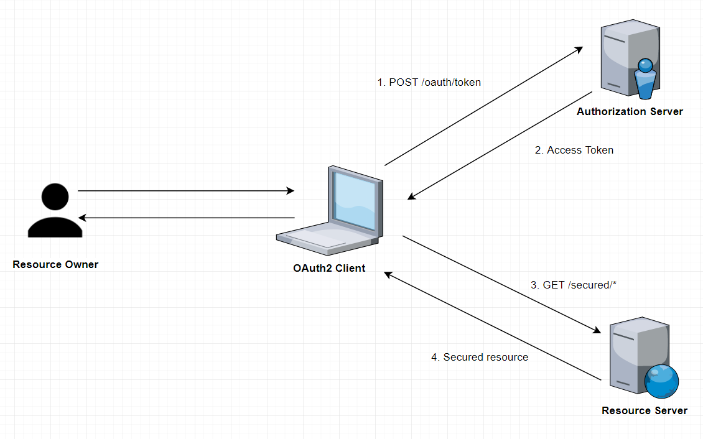
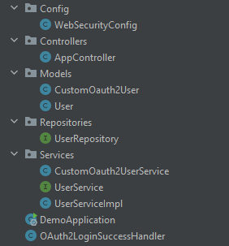
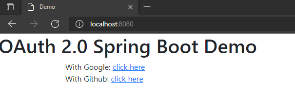
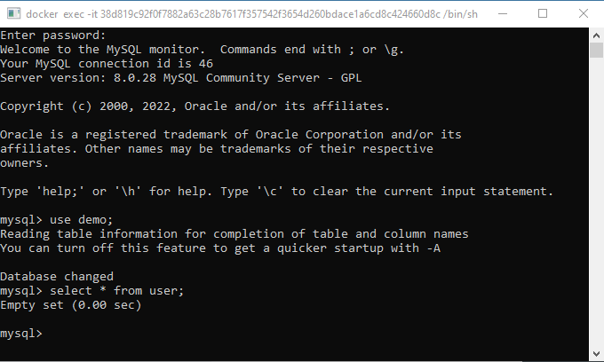
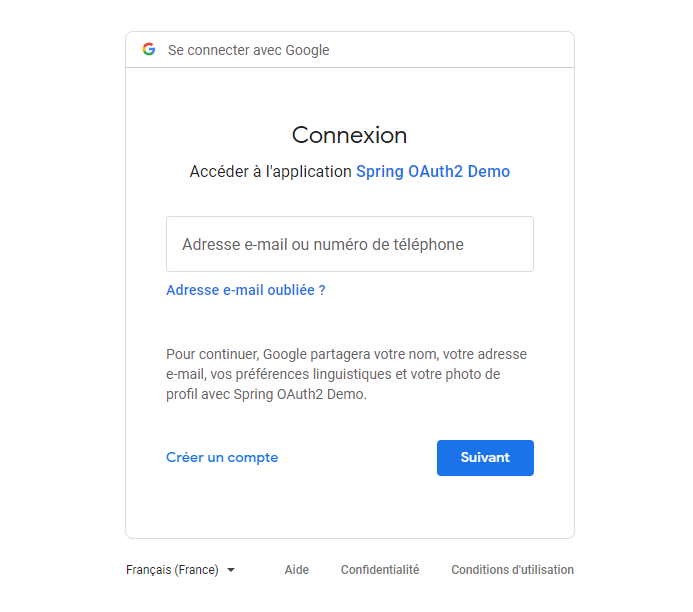
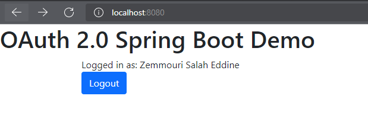

# Spring Boot OAuth 2.0 Client + MySQL
---

## 1. What is OAuth 2.0 ?
The OAuth 2.0 authorization framework enables a third-party
application to obtain limited access to an HTTP service.
## 2. How does OAuth 2.0 work ?

* **Resource Owner**

  An entity capable of granting access to a protected resource.
When the resource owner is a person, it is referred to as an
`end-user`.  
&gt; In other words , it's the end-user that accepts the authorization request.


* **OAuth 2.0 Client**

  An `application` making protected resource requests on behalf of the
resource owner and with its authorization.  


* **Authorization server**

  The server issuing `access tokens` to the client after successfully
authenticating the resource owner and obtaining authorization.  
&gt; This access token will be used later to retrieve the protected resource.


* **Resource Server**

  The server hosting the protected resources, capable of _accepting
and responding_ to protected resource requests using _access tokens_.

  
In our example , we will be interested only to the client side of OAuth 2.  
That is , **registering the user in our mysql database after getting information from the OAuth2 Provider ( Google , Github)**  

&gt; OAuth2 Client is <ins> our spring application. </ins>  
&gt; Resource Owner is <ins> the user. </ins>  
&gt; Authorization/Resource Server is <ins> the OAuth2 provider. </ins>

## 3.Technologies
### Spring Boot Web
### Spring Data JPA
### Spring Security
### Spring OAuth2 Client
### MySQL Database
### Docker ( Optional )
## 4. File Structure


- `WebSecurityConfig`

Extending the _WebSecurityConfigurerAdapter_ class which , along with _@EnableWebSecurity_ annotation
, provides web based security and allows us to do some configurations like restricting some URL's for authentication , rejecting requests or maybe a defining a custom firwall .

- `AppController`

Playing the role of a controller of requests in the MVC architecture thanks to Spring MVC.  
We defined an endpoint "/user" to show the json data sent by the oauth provider after the login success.

- `User` and `CustomOauth2User`

The class _User_ is our Model , in the MVC architecture , marked with _@Entity_ JPA annotation to make the object ready for storage in the database.   
The class _CustomOauth2User_ will be used to get attributes of the data retrieved from the oauth provider.

- `UserRepository`

Extending the _JpaRepository_ class which makes database access very easy and allows us to perform creation , deletion , update and searching of users.

- `UserService` and `CustomOauth2UserService`

Classes that contains the _@Service_ annotation and used to write business logic
like finding a user by email or loading the user from the OauthProvider.

- `OAuth2LoginSuccessHandler`

Extends the class _SimpleUrlAuthenticationSuccessHandler_ which is used to specify any custom logic after the success of the authorization .  
This class is needed to store the user in tha database after the login. 
## 5. How to run the project
### Step 1 : OAuth 2.0 credentials from the Google API Console
Create a new project and get a new pair of OAuth 2.0 clientId and clientSecret.  
you'll need them for spring security oauth configuration in `application.yaml`
```yaml
spring:
  security:
      oauth2:
        client:
          registration:
            google:
              clientId: PASTE_GOOGLE_CLIENT_ID_HERE
              clientSecret: PASTE_GOOGLE_CLIENT_SECRET_HERE
              scope:
                - profile
                - email
```
Scope are the information needed from the oauth provider .  
In our case we need general profile information and also the email ( will be used later )
Also we need to set the URL callback to `/oauth2/authorization/google`
### Step 2 : Creating a MySQL Database Instance
Using docker is not necessary here , you can use our local MySQL.  
In our case we can use _docker compose_ to create our database container.  

`docker-compose.yaml`:
```yaml
version: "3.7"

services:
  mysql:
    image: mysql:8.0
    ports:
      - "3306:3306"
    environment:
      MYSQL_ROOT_PASSWORD: MYSQL_ROOT_PASSWORD
      MYSQL_DATABASE: demo
```
Here we are using the version 3.7 of the docker compose . Then we are fetching the image of mysql version 8.0 from the Docker Registry. We also expose the port 3306 of the machine ( so we can access the container ) and the port 3306 of the container. Finally we set the root password and the name of the database that we want to create ( for example demo ).  

Also we need to configue Spring JPA to use our mysql container.  
`application.yaml`:
```yaml
spring:
  jpa:
    hibernate:
      ddl-auto: update
    show-sql: true
  datasource:
    username: MYSQL_ROOT_USERNAME
    password: MYSQL_ROOT_PASSWORD
    url: jdbc:mysql://localhost:3306/demo
```
Last but not least , we run the command below to create the database instance.

```ignorelang
$ cd spring-boot-oauth2-mysql
$ docker compose up
```
### Step 3 : Running the spring application

---

## DEMO 
Let's demonstrate with our oauth 2.0 client implementation with some basic html template.  



Before we proceed to the authorization server , let's show our current state of the database :



As we can see our user table is currently empty and our goal is to create a new user after the login success.



After clicking the link , we are redirected to a google page for authorization.

And we can hit the endpoint "/user" to take a peak about the data send to us by google. 


And Boom , we obtained the full name and email address , that's exactly what we configured in the `application.yaml`

So now that we have the data we can actually display the name of the user , as well as registering him in the database .


Here we can see the user registered successfully thanks to the class _OAuth2LoginSuccessHandler_ .

And also we updated to front page to show the name of current logged-in user.


